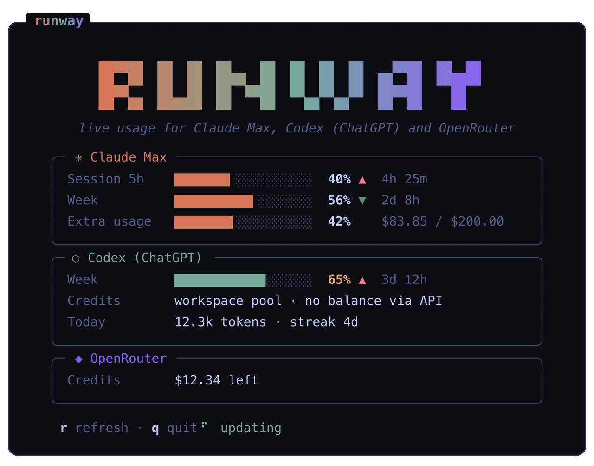

# runway

Mini TUI (built with [OpenTUI](https://opentui.com/)) that shows live usage for your
**Claude Max** and **Codex (ChatGPT)** subscriptions — weekly limits, extra usage
credits — plus your **OpenRouter** and **Vercel AI Gateway** credit balances.

<p align="center">
  
</p>

The interface follows your terminal's light/dark theme, including terminals set to
"system auto" that track the OS appearance (and it re-themes live when it changes).

## Requirements

- [Bun](https://bun.sh)
- A **Claude Code** session on this machine (the token is read from the macOS Keychain,
  entry `Claude Code-credentials`; fallback: `~/.claude/.credentials.json` or
  `CLAUDE_CODE_OAUTH_TOKEN`)
- A **Codex CLI** session (`codex login` creates `~/.codex/auth.json`)
- An **OpenRouter** key, resolved in this order: the macOS Keychain entry written by
  `convoy auth openrouter` (a management key, which unlocks the exact balance), then
  `OPENROUTER_API_KEY`, then the key opencode already stores
  (`~/.local/share/opencode/auth.json`)
- A **Vercel AI Gateway** credential, resolved in this order: `AI_GATEWAY_API_KEY`,
  `VERCEL_OIDC_TOKEN`, then the Vercel key opencode already stores

## Usage

```bash
bun start            # or: bun src/index.ts
```

Keys: `r` refreshes (with a 10 s throttle), `q` or `Ctrl+C` quits.
Auto-refresh every 3 minutes; countdowns tick every second without refetching.

Optional global command: `make install` compiles and installs `runway` into
`~/.local/bin` (or elsewhere with `make install INSTALL_DIR=/usr/local/bin`).
You can also use `bun link`, which makes `runway` available on Bun's PATH.

## Where the data comes from

| Service | Endpoint | Auth |
|---|---|---|
| Claude Max | `GET https://api.anthropic.com/api/oauth/usage` | Bearer from the Keychain + `anthropic-beta: oauth-2025-04-20` + `User-Agent: claude-code/<v>` |
| Codex | `GET https://chatgpt.com/backend-api/wham/usage` | Bearer from `~/.codex/auth.json` + `chatgpt-account-id` header |
| OpenRouter | `GET https://openrouter.ai/api/v1/credits` (fallback: `/api/v1/key`) | Bearer from the Keychain, `OPENROUTER_API_KEY`, or opencode |
| Vercel AI Gateway | `GET https://ai-gateway.vercel.sh/v1/credits` | Bearer from `AI_GATEWAY_API_KEY`, `VERCEL_OIDC_TOKEN`, or opencode |

If the Codex token expires, it's refreshed against `https://auth.openai.com/oauth/token`
(same flow and client id as the official CLI) and persisted to `auth.json`.

## Caveats

- **Internal/undocumented endpoints**: they're the same ones used by Claude Code's
  `/usage` and Codex's `/status`, but they can change without notice. They're read-only:
  the worst that can happen is the CLI shows an error.
- **Don't lower the 180 s polling** for Claude or drop the `User-Agent: claude-code/...`:
  without it, the endpoint returns 429 persistently.
- The Claude token expires every ~60 min and Claude Code refreshes it on use; if you see
  "Token expired", open Claude Code.
- The Codex refresh token **rotates** on every refresh: don't share `auth.json` across
  machines at the same time.
- ChatGPT no longer has a 5h session window: the primary window **is** the weekly one
  (`limit_window_seconds: 604800`, `secondary_window: null`). Row labels follow
  `limit_window_seconds`, so the panel stays correct if the 5h window ever comes back,
  and the old 5h reset credits only appear when the API marks them as applicable.
- Claude's extra usage arrives in cents of a dollar; it's shown as `$used / $limit`.
- On ChatGPT Team/Business plans, Codex credits are a shared workspace pool and the API
  returns `balance: null` — the balance is only visible on the admin's billing page at
  chatgpt.com. The panel shows the pool status and today's activity
  (from `wham/profiles/me`).
- OpenRouter management keys can read `/credits`, so the panel shows the exact balance
  (`total_credits − total_usage`). A regular inference key gets a 403 there and falls
  back to `/key`: the key's remaining limit, or this month's spend when the key has none.
- Vercel AI Gateway's `/credits` endpoint reports the team's remaining balance. Local
  OIDC tokens expire, so use an AI Gateway API key for a persistent setup.
- Keys and tokens are only sent to `api.anthropic.com`, `chatgpt.com`,
  `auth.openai.com`, `openrouter.ai`, and `ai-gateway.vercel.sh`. No telemetry, no
  third parties.
